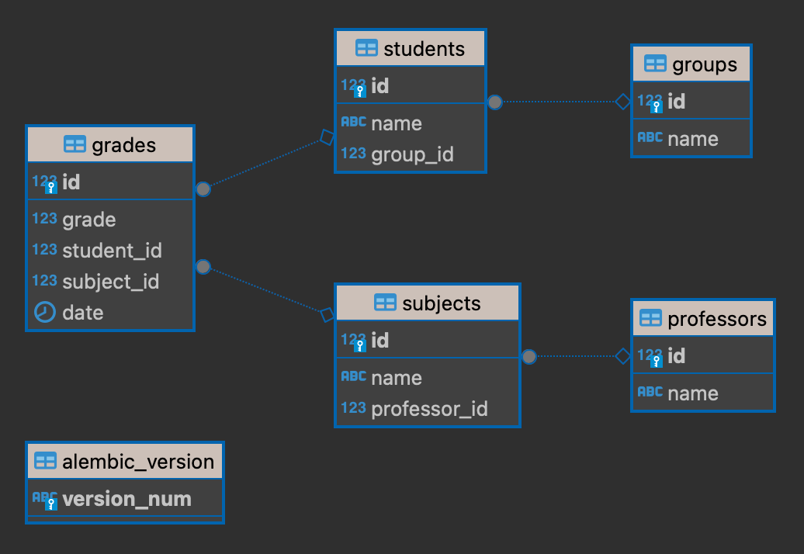

# Project Description

## Overview

This project demonstrates how to interact with a PostgreSQL database using SQLAlchemy, an Object Relational Mapper (ORM), in Python. It showcases various SQL query techniques, including aggregations, joins, subqueries, and filtering. It also leverages Alembic for database schema management.

## Features

- **Seamless Database Interaction:** Connects Python code with PostgreSQL using SQLAlchemy.
- **Diverse SQL Queries:** Executes a range of queries, including:
    - Aggregations (GROUP BY, COUNT, SUM, etc.)
    - Joins (INNER JOIN, LEFT JOIN, etc.)
    - Subqueries
    - Filtering
- **Schema Management:** Handles database schema modifications using Alembic.

## Installation

### Prerequisites

- Python 3.x
- Docker (optional, for running PostgreSQL locally)

### Steps

1. **Set up PostgreSQL:**
    - **Locally:**
      - Pull the PostgreSQL Docker image:
        ```bash
        docker pull postgres
        ```
      - Run the container:
        ```bash
        docker run --name postgress -p 5432:5432 -e POSTGRES_PASSWORD=123456 -d postgres
        ```
    - **Existing Database:** Connect using appropriate credentials.

2. **Install Dependencies:**
    ```bash
    poetry install --no-root
    ```

3. **Activate Virtual Environment:**
    ```bash
    poetry shell
    ```

4. **Create Database Tables:**

   * run command inside virtual environment:
       ```bash
       alembic upgrade head
       ```
   * you should see output
       ```log
       INFO  [alembic.runtime.migration] Context impl PostgresqlImpl.
       INFO  [alembic.runtime.migration] Will assume transactional DDL.
       INFO  [alembic.runtime.migration] Running upgrade  -> ca6d11849959, create tables
       ```
   * table schema will be created


## Usage
- **Fill DB by random test data**
    ```bash
    python seeds.py
    ```

- **Run Queries:**
    ```bash
    python main.py
    ```
- **Modify Queries:** Uncomment or add desired queries in `main.py`.

## Project Structure

- **models.py:** Defines SQLAlchemy models for entities.
- **db.py:** Establishes the database connection.
- **my_select.py:** Contains functions for executing queries.
- **main.py:** Runs the queries and prints results.
- **constants.py:** Stores constant values.
- **alembic.ini** and **alembic** folder: Manage database migrations.
- **cli_app:** See description [below](#cli-app-for-crud-operations).

## Technologies Used

- Python
- SQLAlchemy
- PostgreSQL
- Alembic
- Docker

## CLI App for CRUD Operations

### Description

This command-line interface (CLI) app provides basic CRUD (Create, Read, Update, Delete) operations on database tables using SQLAlchemy.

### Usage

```bash
python3 cli_app.py [-h|--help] -a|--action -m|--model [-n|--name] [-i|--id] [-g|--group_id] [-p|--professor_id]
```

### Arguments


| Argument           | Description                                        | Required |
|--------------------|----------------------------------------------------|----------|
| -h, --help         | Show help message and exit                    | No       |
| -a, --action       | Action to perform (create, list, update, remove)   | Yes      |
| -m, --model        | Model to use (Group, Professor, Student, Subject)  | Yes      |
| -n, --name         | Name of the model instance (for create and update) | No       |
| -i, --id           | ID of the model instance (for update and remove)   | No       |
| -g, --group_id     | ID of the group (for Student create)               | No       |
| -p, --professor_id | ID of the professor (for Subject create)           | No       |

### Examples

```bash
python3 cli_app.py [-h] -a {create,list,update,remove} -m {Group,Professor,Student,Subject} [-n NAME] [-i ID] [-g GROUP_ID] [-p PROFESSOR_ID]
```

- Display help message with available commands

```bash
python3 cli_app.py -h
```

- Create a new student:
    ```bash
    python3 cli_app.py --action create --model Student --name "New Student" --group_id 1
    ```
- List all subjects:
    ```bash
    python3 cli_app.py -a list -m Subject
    ```
- Update a professor's name:
    ```bash
    python3 cli_app.py -a update -m Professor -i 1 -n "Professor Updated"
    ```
- Remove a group:
    ```bash
    python3 cli_app.py --action remove -m Group --id 6
    ```
